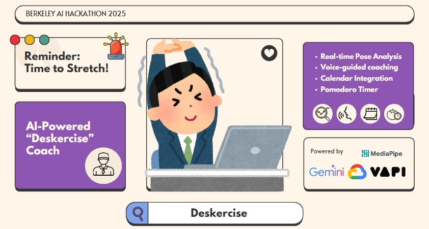

# 🏃‍♂️ Deskercise.AI

*Your AI-Powered Desk Wellness Companion*

[](https://calhacks.io)
[](https://reactjs.org/)
[](https://mediapipe.dev/)
[](https://vapi.ai/)

<div align="center">
  
</div>

> 🔗 **[View on DevPost](https://devpost.com/software/deskercise)** | 📊 **[Presentation](docs/Deskercise%20Pitch%20Deck.pdf)**

---

## 🎯 The Problem

**3AM at hackathons. Endless office hours. Study marathons.**

Millions of people spend hours glued to screens, developing "tech neck," stiffness, and fatigue. Traditional solutions? Awkward yoga poses in public spaces or forgetting to stretch entirely.

## 💡 Our Solution

**Deskercise.AI** transforms your workspace into a wellness station with AI-powered stretch coaching that actually works for real environments.


> "Hour 28 of our hackathon — the rest of the venue looked like a caffeine-fueled zombie apocalypse. Meanwhile, our team was doing shoulder rolls guided by our own AI coach every Pomodoro break. While others crashed at 3AM, we were still sharp, energized, and coding clean. We didn't just build Deskercise; we lived it, and it literally saved our hackathon." 
>
> -- The Deskercise.AI Team, UC Berkeley AI Hackathon 2025 

---

## 🚀 Key Features

### 🍅 **Smart Break Management**
- Pomodoro timer with intelligent stretch recommendations
- Automatic session tracking and analytics
- Calendar integration for meeting break reminders

### 🤖 **AI Stretch Coach**
- **Real-time pose detection** using MediaPipe
- **Voice-powered guidance** with conversational AI
- **Live form correction** and personalized feedback
- **Progress tracking** with XP and streaks

### 🎯 **Desk-Friendly Design**
- Exercises designed for office/study environments
- No awkward poses or equipment needed
- Webcam-based monitoring with privacy-first approach

---

## 🛠️ Tech Stack

| Component | Technology | Purpose |
|-----------|------------|---------|
| **Frontend** | React + Ant Design | User interface |
| **Computer Vision** | MediaPipe Pose | Real-time pose detection |
| **AI Coach** | Vapi + Gemini | Conversational guidance |
| **Multi-Agent** | Unify | Coming Soon... |

---

## ⚡ Quick Start

```bash
# Clone and install
git clone https://github.com/yourusername/deskercise.git
cd deskercise
npm install

# Set up environment variables
cp sample.env .env
# Edit .env with your actual API keys (see API Setup section below)

# Start development server
npm start
```

**Requirements:** 
- Node.js 14+
- Modern browser with webcam
- API keys for Google Calendar, Gemini AI, and Vapi Voice AI

---

## 🔑 API Setup

Deskercise requires several API keys to function properly. Follow these steps to get your keys:

### 1. Google APIs (Calendar & OAuth)
1. Go to [Google Cloud Console](https://console.cloud.google.com/)
2. Create a new project or select existing one
3. Enable the following APIs:
   - Google Calendar API
   - Google+ API
4. Create OAuth 2.0 credentials for `REACT_APP_GOOGLE_CLIENT_ID`
5. Create API key for `REACT_APP_GOOGLE_API_KEY`

### 2. Google Gemini AI
1. Visit [Google AI Studio](https://makersuite.google.com/app/apikey)
2. Create a new API key
3. Add it as `REACT_APP_GEMINI_API_KEY`

### 3. Vapi Voice AI
1. Sign up at [Vapi.ai](https://vapi.ai/)
2. Create a new assistant
3. Get your API key and assistant ID
4. Add them as `REACT_APP_VAPI_API_KEY` and `REACT_APP_VAPI_ASSISTANT_ID`

### Environment Variables
Copy `sample.env` to `.env` and replace the placeholder values:

```bash
cp sample.env .env
```

Then edit `.env` with your actual API keys:
```
REACT_APP_GOOGLE_CLIENT_ID=your_actual_google_client_id
REACT_APP_GOOGLE_API_KEY=your_actual_google_api_key
REACT_APP_GEMINI_API_KEY=your_actual_gemini_api_key
REACT_APP_VAPI_API_KEY=your_actual_vapi_api_key
REACT_APP_VAPI_ASSISTANT_ID=your_actual_vapi_assistant_id
```

**Note:** Never commit your `.env` file to version control. It's already included in `.gitignore`.

---

## 🎮 How It Works

1. **Set Your Focus Time** - Start a Pomodoro session
2. **Get Smart Reminders** - AI suggests stretch breaks at optimal times
3. **Follow AI Guidance** - Voice coach walks you through exercises
4. **Perfect Your Form** - Real-time pose analysis ensures proper technique
5. **Track Progress** - Build streaks and improve your wellness metrics

---

## 🧠 AI Architecture

```
MediaPipe Pose → Pose Analysis → Unify Coordinator
     ↓                              ↓
Webcam Feed ←→ Real-time Feedback ←→ Vapi Voice Coach
                                    ↓
                              Gemini LLM (Context)
```

**Smart Agents:**
- **HoldTrackerAgent**: Monitors pose duration and quality
- **FeedbackAgent**: Generates contextual improvement suggestions
- **VoiceCoachAgent**: Provides natural language guidance
- **XPTrackerAgent**: Gamifies progress with streaks and achievements
- **PlannerAgent**: Selects optimal exercises based on user history

---

## 👥 Meet The Team

<table>
<tr>
<td align="center">
<b>Abhishek Kumar</b><br>
<i>Full Stack Lead</i><br>
<a href="https://www.linkedin.com/in/abhi-s7/">LinkedIn</a>
</td>
<td align="center">
<b>Mohamad Mansour</b><br>
<i>AI/Computer Vision Engineer</i><br>
<a href="https://www.linkedin.com/in/mohamadmansour/">LinkedIn</a>
</td>
<td align="center">
<b>Rachel Lim</b><br>
<i>Full Stack Developer</i><br>
<a href="https://www.linkedin.com/in/rachellimuen/">LinkedIn</a>
</td>
<td align="center">
<b>Megan Jacob</b><br>
<i>Integration Specialist</i><br>
<a href="https://www.linkedin.com/in/megan-jacob/">LinkedIn</a>
</td>
</tr>
</table>

---

## 🌟 Market Impact

### **Corporate Wellness**
- Reduce healthcare costs from repetitive strain injuries
- Boost employee productivity and satisfaction
- Seamless integration with existing workflows

### **Educational Institutions** 
- Combat "Zoom fatigue" in remote learning
- Promote healthy study habits
- Scalable solution for student wellness programs

### **Individual Users**
- Prevent long-term posture-related health issues
- Gamified approach increases engagement
- Privacy-focused design builds trust

---

## 🚀 Future Roadmap

#### 🤖 **AI Enhancements**
- [ ] **Multilingual voice coaching** with cultural adaptation
- [ ] **Predictive wellness analytics** to prevent strain before it occurs
- [ ] **Eye tracking integration** for comprehensive fatigue detection
- [ ] **Smart calendar analysis** for optimal break scheduling
- [ ] **Advanced pose tracking analysis** for better tracking.
- [ ] **More Real-time AI coach assistance** with dynamic workout adjustments

#### 📱 **Platform Expansion**
- [ ] Mobile companion app
- [ ] Team challenges and corporate dashboards
- [ ] Wearable device integration
- [ ] VR/AR stretch environments

---

## 🏆 Awards & Recognition

**🥇 CalHacks AI 2025 - Best AI Tool**

Built in 36 hours, Deskercise represents the future of workplace wellness through intelligent, accessible, and engaging technology.

---

## 📞 Get Involved

**Ready to transform workplace wellness?**

- 🌐 **Demo**: [DevPost Submission](https://devpost.com/software/deskercise)
- 📧 **Contact**: Connect with our team on LinkedIn
- 🤝 **Partnerships**: Open to corporate pilots and educational collaborations

---

<div align="center">

**Made with ❤️ for a healthier digital world**

*Because your wellbeing shouldn't wait for the weekend*

